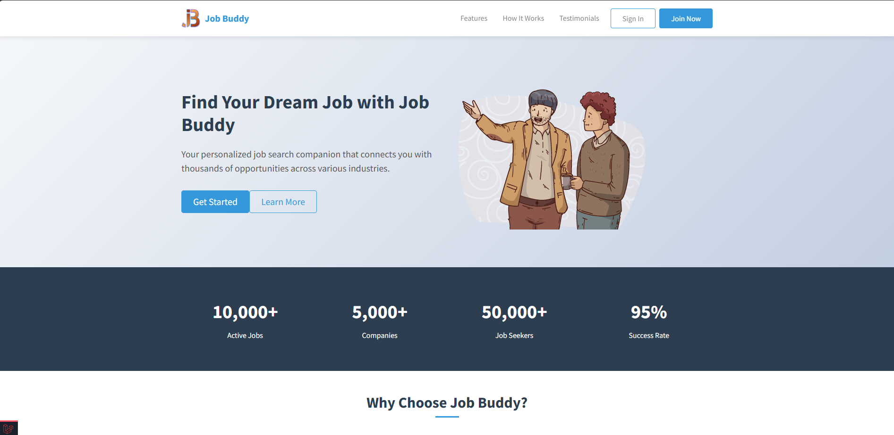
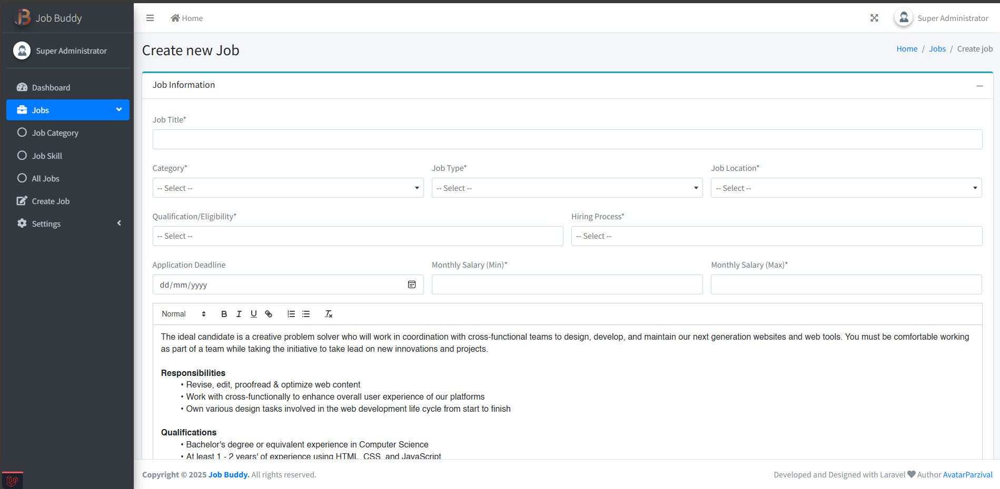
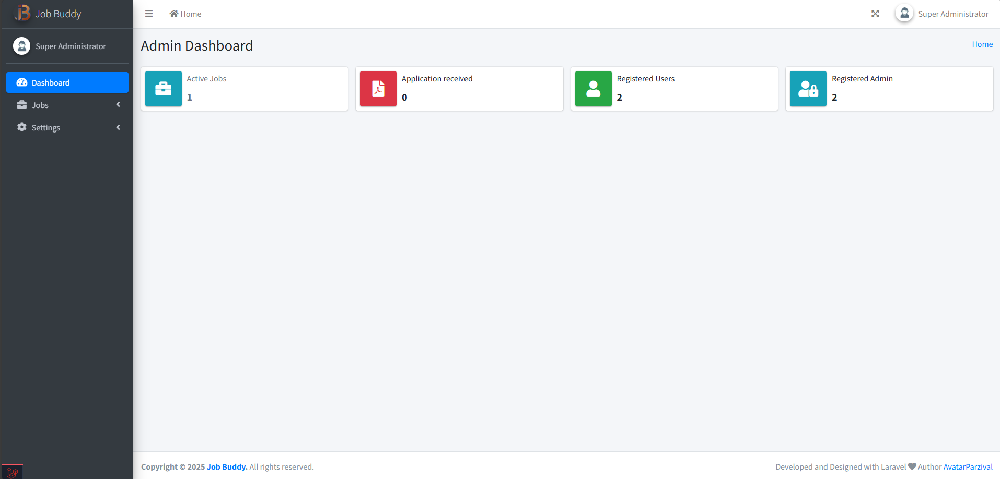
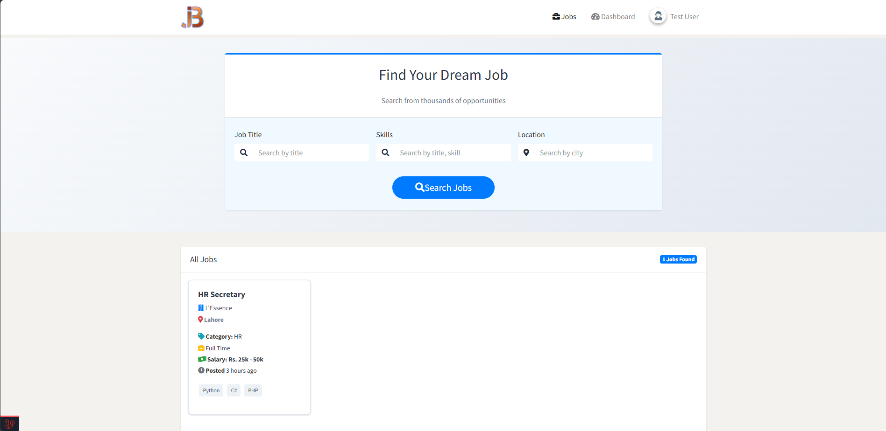

# Job Buddy | Laravel Full Stack Application


**Job Buddy** is a full-featured **Job Portal** built with **Laravel & MySQL**, providing a secure platform for job seekers and employers.  
It includes authentication, role-based dashboards, job postings, applications, and an admin panel — all in a modern responsive UI.

---

## 📑 Table of Contents

1. [Features](#-features)  
2. [Security Features](#-security-features)  
3. [Tech Stack](#-tech-stack)  
4. [Composer Packages](#-composer-packages)  
5. [Demo Accounts](#-demo-accounts)  
6. [Setup & Installation](#%EF%B8%8F-setup--installation)  
7. [Database Setup](#-database-setup)  
8. [Environment Configuration](#-environment-configuration)  
9. [Screenshots](#-screenshots)  
10. [Contribution](#-contribution)  
11. [License](#-license)  
12. [Author](#-author)  

---

## 🚀 Features

### Job Seeker
- Register, login, and manage profile (skills, resume, experience)  
- Browse & filter jobs by title, skills, salary, and location  
- Apply for jobs & view application history  

### Admin
- Secure login  
- Post new jobs with required skills, salary, and qualifications  
- Manage job listings (edit/delete)  
- View applicants and download resumes  
- Dashboard showing statistics (total users, employers, jobs posted)  

### General
- Responsive design with **Bootstrap/Tailwind**  
- Role-based dashboards  
- Resume upload/download system  
- Categories, skills, and qualification tagging for jobs  

---

## 🔐 Security Features
- Passwords encrypted with **bcrypt (Laravel Hashing)**  
- Role-based access control via **Laratrust**  
- CSRF protection on all forms  
- SQL injection prevention via **Eloquent ORM**  
- File validation for secure uploads  
- Middleware-based authentication & authorization  

---

## 🛠 Tech Stack

  
  
  
  
  
  
  

---

## 📦 Composer Packages

**Main Dependencies:**  
- `laravel/framework` ^8.12 → Core Laravel Framework  
- `santigarcor/laratrust` ^6.3 → Role & Permission Management  
- `laravel/ui` ^3.1 → Authentication scaffolding  
- `laravel/tinker` ^2.5 → REPL for Laravel  
- `fideloper/proxy` ^4.4 → Trusted proxy handling  
- `fruitcake/laravel-cors` ^2.0 → CORS support  
- `guzzlehttp/guzzle` ^7.0.1 → HTTP client  

**Dev Dependencies:**  
- `phpunit/phpunit` ^9.3.3 → Testing framework  
- `barryvdh/laravel-debugbar` ^3.5 → Debugging toolbar  
- `fakerphp/faker` ^1.9.1 → Fake data generator  
- `mockery/mockery` ^1.4.2 → Mocking for tests  
- `nunomaduro/collision` ^5.0 → Error reporting  
- `facade/ignition` ^2.5 → Error debugging UI  
- `laravel/sail` ^0.0.5 → Docker environment  

---

## 👤 Demo Accounts

**Admin**  
- Email: `admin@gmail.com`  
- Password: `123456`  

**Super Admin**  
- Email: `super@gmail.com`  
- Password: `123456`  

**Job Seeker**  
- Email: `user@admin.com`  
- Password: `123456`  

---

## ⚙️ Setup & Installation

### 1. Clone Repository
```bash
git clone https://github.com/AvatarParzival/Job-Buddy-Laravel.git
cd job-portal
```

### 2. Install PHP Dependencies (via Composer)
```bash
composer install
```

### 3. Install Frontend Assets (via NPM)
```bash
npm install
npm run dev
```

### 4. Configure Environment
Duplicate `.env.example` and rename to `.env`, then set your database details:  
```env
DB_CONNECTION=mysql
DB_HOST=127.0.0.1
DB_PORT=3306
DB_DATABASE=laravel
DB_USERNAME=root
DB_PASSWORD=
```

### 5. Generate Application Key
```bash
php artisan key:generate
```

### 6. Run Migrations & Seeders
```bash
php artisan migrate --seed
```

### 7. Start Development Server
```bash
php artisan serve
```

Now visit → [http://localhost:8000](http://localhost:8000)

---

### 🖥 Running with XAMPP

1. Install [XAMPP](https://www.apachefriends.org/index.html) and ensure **Apache** & **MySQL** are running.  
2. Place the project folder inside the `htdocs` directory (e.g., `C:/xampp/htdocs/job-portal`).  
3. Open **phpMyAdmin** at [http://localhost/phpmyadmin](http://localhost/phpmyadmin) and create a database:  
   ```sql
   CREATE DATABASE laravel;
   ```
4. Import migrations & seeders via command line:  
   ```bash
   php artisan migrate --seed
   ```
5. Start Laravel from inside the project folder:  
   ```bash
   php artisan serve
   ```
6. Visit [http://localhost:8000](http://localhost:8000) or access via Apache vhost.

---

## 🗄 Database Setup
You have **two options** to set up the database:

### 1. Using Laravel Migrations & Seeders (recommended)
```bash
php artisan migrate --seed
```
This will create all tables and insert demo users, jobs, categories, and skills.

Tables include:  
- **users** (with roles: admin, employer, seeker)  
- **jobs** (linked to employers)  
- **applications** (job seeker ↔ job)  
- **skills, categories, qualifications, profiles, cities, countries, states**  

Seeders included:  
- `UserSeeder` → Creates demo users (admin, employer, seeker)  
- `JobSeeder` → Inserts sample jobs  
- `SkillSeeder`, `CategorySeeder`, `ProfileSeeder` → Populate initial data
- 
### 2. Importing Provided SQL File
Use the pre-built `laravel.sql` file:
1. Open **phpMyAdmin** or your MySQL client.  
2. Create a new database:
   ```sql
   CREATE DATABASE laravel;
   ```
3. Import the file:
   ```bash
   mysql -u root -p laravel < laravel.sql
   ```
4. Update your `.env` file to match:
   ```env
   DB_DATABASE=laravel
   DB_USERNAME=root
   DB_PASSWORD=
   ```

---

## 🌍 Environment Configuration

Example `.env` file:

```env
APP_NAME="Job Buddy"
APP_ENV=local
APP_KEY=
APP_DEBUG=true
APP_URL=http://localhost

LOG_CHANNEL=stack
LOG_LEVEL=debug

DB_CONNECTION=mysql
DB_HOST=127.0.0.1
DB_PORT=3306
DB_DATABASE=laravel
DB_USERNAME=root
DB_PASSWORD=

BROADCAST_DRIVER=log
CACHE_DRIVER=file
QUEUE_CONNECTION=sync
SESSION_DRIVER=file
SESSION_LIFETIME=120

MEMCACHED_HOST=127.0.0.1

REDIS_HOST=127.0.0.1
REDIS_PASSWORD=null
REDIS_PORT=6379

MAIL_MAILER=smtp
MAIL_HOST=mailhog
MAIL_PORT=1025
MAIL_USERNAME=null
MAIL_PASSWORD=null
MAIL_ENCRYPTION=null
MAIL_FROM_ADDRESS=null
MAIL_FROM_NAME="${APP_NAME}"

AWS_ACCESS_KEY_ID=
AWS_SECRET_ACCESS_KEY=
AWS_DEFAULT_REGION=us-east-1
AWS_BUCKET=

PUSHER_APP_ID=
PUSHER_APP_KEY=
PUSHER_APP_SECRET=
PUSHER_APP_CLUSTER=mt1

MIX_PUSHER_APP_KEY="${PUSHER_APP_KEY}"
MIX_PUSHER_APP_CLUSTER="${PUSHER_APP_CLUSTER}"
```

---

## 📸 Screenshots

_Add your project screenshots here (e.g. login, dashboard, job posting)._  
Example:  

- 
-   
-   
-   

---

## 🤝 Contribution

Contributions are welcome! 🚀  

1. Fork the repository  
2. Create a new feature branch (`git checkout -b feature/YourFeature`)  
3. Commit changes (`git commit -m "Add new feature"`)  
4. Push branch (`git push origin feature/YourFeature`)  
5. Open a Pull Request  

Make sure your code follows PSR-12 coding standards and passes all tests (`php artisan test`).  

---

## 👨‍💻 Author  

Developed by **Abdullah Zubair**  
📧 abdullah69zubair@gmail.com

---

## 📜 License

This project is licensed under the **MIT License** - see the [LICENSE](LICENSE) file for details.
